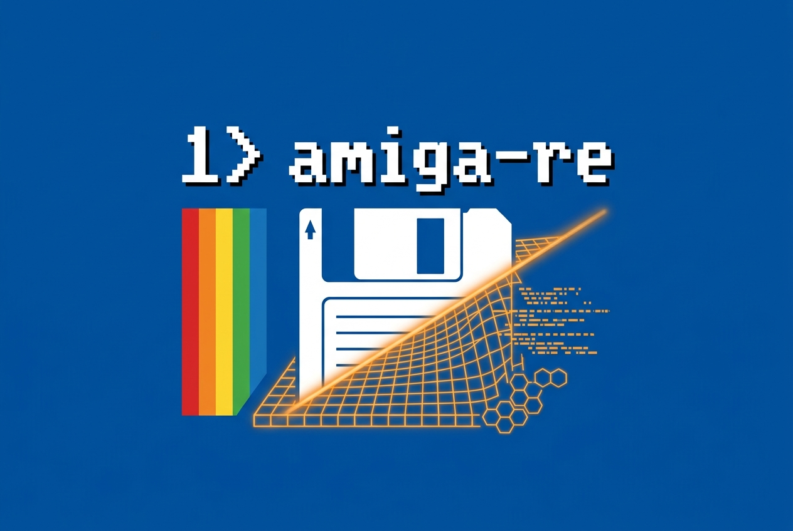

# amiga-re

<p align="left">
  
</p>

**Discover how Amiga software works — with tools built for humans and AI agents.**
Recover files from disk images, unpack executables, explore MC68000 code, decode
graphics and audio, and trace routines in a bounded Amiga sandbox. From raw bytes
to named functions and reconstructed frames, amiga-re helps turn old software
into knowledge you can inspect, verify, and build on.

**Go further with AI-assisted reverse engineering.** Structured JSON results,
machine-readable schemas, and evidence-backed analysis give AI assistants concrete
data to investigate. Reproducible recipes and reviewed write plans let you check
their work and stay in control of changes. Use the CLI interactively, connect it
to your AI workflow, or build your own tools on the reusable Rust libraries.


## Crates

| Crate              | What it does                                                                                                                                                                               |
|--------------------|--------------------------------------------------------------------------------------------------------------------------------------------------------------------------------------------|
| `amiga-core`       | Bounds-checked big-endian `Reader`, provenance/SHA-256 manifests, safe output-path handling.                                                                                               |
| `amiga-hunk`       | Read-only Amiga LoadSeg/HUNK executable parser (segments + relocations).                                                                                                                   |
| `amiga-adf`        | Read-only, recovery-oriented AmigaDOS disk-image reader: OFS and FFS, both enumerated and recovered.                                                                                       |
| `amiga-hw`         | Copper-list scanner, custom-chip register map, RGB4→RGB8, planar bitplanes, and an OCS area-mode blitter.                                                                                                      |
| `amiga-disasm`     | MC68000 control-flow and dataflow analysis, semantic reports, function/stack inference, and a bounded RAM sandbox over the `m68000` crate.                                                        |
| `amiga-env`        | A bounded, offline execution environment over that sandbox: a documented memory map, a fake ExecBase, a synthetic trackdisk IORequest, and enough OCS chip emulation for boot code to run. |
| `amiga-compress`   | Amiga decompressors: headerless PowerPacker, IFF ByteRun1 (bounded and unbounded), position-XOR + escape-marker RLE.                                                                       |
| `amiga-iff`        | IFF containers, 8SVX and ILBM decoding, PCM scanning, tracker-module detection, and WAV export.                                                                                                       |
| `amiga-analysis`   | Shared typed survey and extraction orchestration consumed by `amiga-operations`.                                                                                                           |
| `amiga-operations` | The typed operation API used by the CLI and downstream tools: one request/response vocabulary, bounded limits, stable diagnostics, source resolution, exhaustive routing.                  |
| `amiga-project`    | The versioned project format: bundled Draft 2020-12 schemas, typed documents, a bounded loader, and semantic validation with stable problem codes.                                         |

The `amiga-re` binary (in `tools/amiga-re-cli`) ties them together.

## CLI

```bash
cargo run -p amiga-re-cli -- <command>
```

To install the `amiga-re` command from this checkout:

```bash
cargo install --path tools/amiga-re-cli --locked
amiga-re --help
```

Use `amiga-re <command> --help` for the complete options. The overview below
covers the current workflows.

| Command                                                                  | Purpose                                                                                                                                                                                                                                                                                                                                                                                                                                                                          |
|--------------------------------------------------------------------------|----------------------------------------------------------------------------------------------------------------------------------------------------------------------------------------------------------------------------------------------------------------------------------------------------------------------------------------------------------------------------------------------------------------------------------------------------------------------------------|
| `adf list \| extract`                                                    | Inspect or extract an AmigaDOS disk image. `list` is bounded by `--max-entries` and always reports the true total; recovered inconsistencies are printed as warnings.                                                                                                                                                                                                                                                                                                            |
| `boot info \| disasm \| trace`                                           | Decode a floppy boot block, disassemble its boot code (exec LVOs named), or run it in the bounded offline environment — reporting the chip registers it pokes and the exec calls it makes, and optionally dumping the tracks its trackloader reads.                                                                                                                                                                                                                              |
| `hunk list`                                                              | List the segments and relocations of a HUNK executable.                                                                                                                                                                                                                                                                                                                                                                                                                          |
| `disasm linear \| flow`                                                  | Disassemble a code range or follow control flow from entry points.                                                                                                                                                                                                                                                                                                                                                                                                               |
| `disasm globals \| annotate`                                             | Map A5-relative variables (or absolute-addressed ones with `--absolute`), or render the unified annotated listing: symbols, library calls, hardware registers, globals, references, arithmetic hints, and warnings, with confidence markers (`--verbose` adds every fact and its evidence).                                                                                                                                                                                      |
| `disasm report`                                                          | Compose every analysis into one semantic fact report — a function index, per-function headers, and typed facts with confidence, producer, and evidence — as grep-friendly text or versioned JSON. Narrow it with `--function`, `--range`, `--only`, `--subsystem`, and `--min-confidence`; order the index with `--order`; `--dot` writes the call graph beside it. A narrowed report states what it excluded and stops answering the questions its narrowing made unanswerable. |
| `disasm query` | Query callers, callees, address references, globals, or custom-register accesses in the composed fact graph. |
| `disasm fixed-point`                                                     | Report fixed-point (Q-format) multiply/divide idioms and their fractional bit count.                                                                                                                                                                                                                                                                                                                                                                                             |
| `disasm symbols \| callgraph`                                            | Emit discovered entries as a `[[symbols]]` stub, or export the function/call graph as JSON/DOT.                                                                                                                                                                                                                                                                                                                                                                                  |
| `run \| trace`                                                           | Execute a CODE hunk in bounded sandbox RAM, optionally retaining an instruction trace.                                                                                                                                                                                                                                                                                                                                                                                           |
| `call`                                                                   | Invoke one routine and emit a stable input/output golden record. Seed memory with hex, image ranges, or pinned artifacts; export ranges, run named case matrices or stateful timelines, and slice dependencies back from a result.                                                                                                                                                                                                                                               |
| `compare`                                                                | Compare golden call records semantically, separating changed inputs, outputs, memory, and the first trace divergence.                                                                                                                                                                                                                                                                                                                                                            |
| `frame capture`                                                          | Run a custom-chip sandbox and reconstruct the indexed, source-plane, and RGBA frame the display hardware would have shown.                                                                                                                                                                                                                                                                                                                                                       |
| `state snapshot \| compare`                                              | Decode machine memory through a project's reviewed types and globals, or compare two typed snapshots field by field.                                                                                                                                                                                                                                                                                                                                                             |
| `xref addr \| relocs \| refs \| to`                                      | Resolve addresses against a mapped origin, follow relocations, and cross-reference pointers.                                                                                                                                                                                                                                                                                                                                                                                     |
| `strings`                                                                | Dump printable strings with offsets (whole file or one hunk).                                                                                                                                                                                                                                                                                                                                                                                                                    |
| `copper scan \| decode \| patch-xref`                                    | Locate Copper lists, decode one instruction-by-instruction, or trace CPU writes that patch a runtime copy.                                                                                                                                                                                                                                                                                                                                                                       |
| `hw registers \| xref`                                                   | Print the custom-chip register map, or map a hunk's register accesses.                                                                                                                                                                                                                                                                                                                                                                                                           |
| `bitmap render \| detect`                                                | Decode a planar region or glyph contact sheet to an indexed PNG, or classify regions by entropy and guess bitmap geometry.                                                                                                                                                                                                                                                                                                                                                       |
| `bitmap compare` | Compare decoded or planar images by palette indices and colours; optionally export a heatmap and overlay. |
| `bob extract`                                                            | Decode a blitter object to an indexed PNG with its transparency mask — interleaved, a separate mask plane, or a colour index.                                                                                                                                                                                                                                                                                                                                                    |
| `palette scan \| export`                                                 | Locate standalone RGB4 palette tables, or export one as a swatch PNG.                                                                                                                                                                                                                                                                                                                                                                                                            |
| `table dump`                                                             | Decode a region as an array of fixed-layout big-endian records.                                                                                                                                                                                                                                                                                                                                                                                                                  |
| `table summary`                                                          | Summarize those records' columns — distinct values, frequencies, extremes — and compare the same column across several files. Every count is exact; only the lists beside them are capped.                                                                                                                                                                                                                                                                                       |
| `dump`                                                                   | Hex + ASCII view of a region in the toolkit's address frames, marking relocation sites.                                                                                                                                                                                                                                                                                                                                                                                          |
| `survey`                                                                 | Run every locator and print one ordered offset-range → type map of a binary. Bounded by `--max-input-bytes` and `--max-regions`; a capped list always reports its true total.                                                                                                                                                                                                                                                                                                    |
| `scan pointers`                                                          | Find in-image longword/scaled-word pointer tables; optionally seed flow analysis.                                                                                                                                                                                                                                                                                                                                                                                                |
| `iff image \| samples \| to-wav`                                         | Describe an ILBM image FORM, inspect an 8SVX sample, or write the sample as a named WAV file with its provenance manifest beside it.                                                                                                                                                                                                                                                                                                                                             |
| `sample scan \| to-wav`                                                  | Heuristically flag raw 8-bit Paula PCM regions, or export a region (offset/length/rate) to WAV.                                                                                                                                                                                                                                                                                                                                                                                  |
| `mod scan \| extract`                                                    | Detect ProTracker/SoundTracker modules, or rip one to a `.mod`.                                                                                                                                                                                                                                                                                                                                                                                                                  |
| `unpack powerpacker \| rle-xor`                                          | Decompress a headerless PowerPacker stream, or a position-XOR + marker-RLE stream.                                                                                                                                                                                                                                                                                                                                                                                               |
| `config show \| check`                                                   | Show the resolved `amiga-re.toml`, or verify its pinned media SHA-256s.                                                                                                                                                                                                                                                                                                                                                                                                          |
| `project init \| extract`                                                | Create a project from selected sources, then recover its registered carriers into reproducible objects.                                                                                                                                                                                                                                                                                                                                                                          |
| `project check \| show \| verify \| inventory`                           | Validate and summarize a project, verify every source and object without writing, or preview the inventory a directory source would pin.                                                                                                                                                                                                                                                                                                                                         |
| `project annotate \| comment \| rename \| rebase \| remove`              | Record, explain, rename, rebase, or remove reviewed knowledge through conflict-checked edits.                                                                                                                                                                                                                                                                                                                                                                                    |
| `project resource define \| update \| export \| remove \| forget`        | Record a reproducible decode, update it, export its artifact, or remove either side of that relationship safely.                                                                                                                                                                                                                                                                                                                                                                 |
| `project register-capture \| format \| annotations \| schema` | Register non-reproducible captured evidence, canonicalize documents, query annotations, or emit schemas.                                                                                                                                                                                                                                                                                                                                           |
| `diff`                                                                   | Compare two HUNK images hunk-by-hunk (structural comparison), printing the comparison or writing it as a report with `--output`.                                                                                                                                                                                                                                                                                                                                                 |
| `carve`                                                                  | Cut a byte region to a file with a provenance manifest.                                                                                                                                                                                                                                                                                                                                                                                                                          |
| `manifest`                                                               | Write a provenance manifest (source SHA-256) for a file.                                                                                                                                                                                                                                                                                                                                                                                                                         |
| `operations \| operations run`                                           | List the structured operations this build serves, or execute one request document.                                                                                                                                                                                                                                                                                                                                                                                               |
| `schema`                                                                 | Print a bundled operation JSON Schema, or emit the whole set with `--output`.                                                                                                                                                                                                                                                                                                                                                                                                    |

Project objects can also be derived by replaying a pinned sandbox recipe.
See [project sandbox recipes](docs/project-sandbox-recipes.md) for the format,
input bindings, execution bounds, and verification workflow.

### The structured operation boundary

The commands above are conveniences for a person at a terminal, and their text
output is not a contract. Automation should use the structured boundary
instead: it builds the same typed requests and calls the same handlers, but
speaks documents in both directions. The operation protocol and semantic
report JSON are separate formats, each with its own version.

```bash
amiga-re operations                       # what this build serves
amiga-re schema container.adf.list        # the contract for one operation
amiga-re operations run --request req.json
amiga-re operations run --request - --response jsonl < req.json
```

For example, `req.json` can inspect a source relative to the working directory:

```json
{
  "protocol_version": 1,
  "request": {
    "operation": "source.survey",
    "arguments": {
      "source": { "kind": "file", "path": "sample.bin" }
    }
  }
}
```

`--response json` is the default for `operations run` and writes one response
document for a parsed request. `--response jsonl` writes objects tagged with
`message_type`: after successful normalization, an `accepted` line carries the
request digest, followed by any `event` lines and the final `response`. A
normalization refusal produces only the response. Events include `started`,
`progress`, `diagnostic`, and an explicit `truncated` notice when capped. The
response remains authoritative and retains the operation's diagnostics.
Diagnostics are also echoed to standard error; `--quiet` suppresses that echo.
Unreadable request files or malformed request JSON fail at the CLI boundary
before a response envelope exists.

Exit codes are deliberately coarse — detail belongs in the response's `status`
and its stable diagnostic codes:

| Code | Meaning                                     |
|------|---------------------------------------------|
| 0    | `success` or `prepared`                     |
| 1    | Operation error, or a CLI error before a response exists |
| 2    | Request validation failure reported in the response |
| 3    | `cancelled`                                 |
| 4    | `conflict`                                  |

Operations that write files are `prepared_output`: they accept only
`prepare`, which reports a complete write plan and writes nothing, and
`commit_reviewed`, which names the plan digest the caller approved. The commit
re-derives the plan and writes only if the digest still matches; a changed plan
returns `conflict`. The library host must supply a destination resolver.
`operations run` supplies only source resolution, so it cannot prepare or commit
file output. Use the corresponding CLI export/extraction command or configure
an `ExecutionContext` in a library host. `amiga-re adf extract` performs both
halves and prints the plan digest it committed.

[`docs/operations.md`](docs/operations.md) is the generated operation
reference for current workflows: operation access classes and arguments with their
defaults, rendered from the catalog and the bundled schemas rather than
maintained by hand.

The control-flow commands (`disasm flow`/`globals`/`annotate`, `xref refs`, `hw xref`) take
`--base` to rebase a runtime-relocated image (see `[base]` below).

`disasm flow` prints the whole hunk by default — the reachable listing plus
`DC.W` for everything it did not reach. `--function ADDR` (repeatable) narrows it
to the instructions one traversal-discovered function entry owns, `--start`/`--end`
to an offset window, and `--no-data` drops the unreached runs. The bounds are a
rendering choice only: the traversal still covers the whole hunk, the coverage
header still counts it, and a bounded listing names the calls that leave the
selection and the unresolved flow inside it, so the lines it removed take nothing
with them. An address that is not a function entry is refused rather than
printing an empty listing.

Control-flow analysis recognizes range-checked data jump tables as well as
`BRA.W` stub tables. Supported data dispatches use an unsigned `CMP[I]`/`BHI`
guard, explicit word/long index scaling (`ADD` or immediate left shifts), and
either a relative-word load followed by an indexed `JMP`, or a longword pointer
load into an address register followed by `JMP (An)`. Table bases can be
PC-relative or established by `LEA`; absolute pointers respect the supplied
rebase and relocations. Recognition is bounded to 256 entries and a 12-instruction
dispatch suffix, with at most eight discovery/validation rounds. Every entry
must name valid code in the analyzed image, and newly discovered paths must not
bypass the guard. Missing bounds, malformed entries, cross-hunk pointers, and
unsettled discovery retain an unresolved-flow warning instead of partial targets.

Fixed-point idiom hints require an uninterrupted basic-block path with no
intervening write to the value register. Q scales propagate along the control-flow
graph and survive joins only when every incoming path agrees; calls discard
unproved register scales. Unresolved intraprocedural flow prevents propagation.

Sandbox commands map the selected hunk at `[base].origin` and start at
`[base].entry` when configured; additional relocation
targets require `--hunk-base HUNK=ADDR` so their real runtime addresses are
explicit rather than guessed.

`trace <executable> --watch w:0x1000:4` records writes overlapping that
range in the instruction trace. Use `r` or `rw` for reads or both, and
`--watch-stop` to stop after the first matching instruction. Add `--watch-only`
to print only instructions with watch hits; execution and the final-state
summary are unchanged. `--watch-only` and `--watch-stop` are mutually exclusive.

## Per-project configuration

A downstream project may keep its title-specific knobs in an `amiga-re.toml`
beside its sources — media paths, the fixed mapped origin/default entry, default
bitmap geometry, a symbol table, and pinned source SHA-256s. The toolkit stays
game-agnostic; the config carries the specifics. It is discovered upward from the
working directory (like `Cargo.toml`) or passed with the global `--config <file>`
flag. Media-oriented convenience commands accept a `@name` reference in place
of a path, resolved against `[[media]]` (for example, `dump @exe`). Structured
operation requests use source locators relative to the adapter's source root;
`operations run` does not expand configuration aliases in the JSON document.
Example:

```toml
[project]
name = "sample-project"
output = "decoded"

[[media]]
name = "exe"
path = "extracted/sample.hunk"
# SHA-256 of the synthetic bytes "sample executable"
sha256 = "4c53f0de63bd881b40615ea5485a4edfb5eed746af31dd6ad513f9f5c9a34382"

[base]
origin = 0x10000             # hunk offset = abs − origin
entry = 0x100c2              # optional default execution/analysis entry

[[symbols]]
addr = 0x10200
name = "load_track"       # a fallback: a project's annotations win, see below

[[fd]]
library = "exec"            # extend/override LVO names from a local NDK
path = "fd/exec_lib.fd"     # .fd file (kept downstream; often not redistributable)
```

### Names from a project

A project (`amiga-re.project.json`) records reviewed names as annotations, and
the control-flow commands use them: `disasm annotate`, `report`, `globals`, and
`xref` label an image from its `function`, `symbol`, and base-register
`variable` annotations, falling back to the config `[[symbols]]` table. The
project is discovered upward from the working directory or named with the global
`--project <dir>` flag.

Which image is decided by **digest, never by path**: the names apply only when
some image's object digest equals the digest of the bytes being analyzed, so one
module's names can never land on another's offsets. A listing that used a
project says so in its header, a stale annotation is withheld and reported as
withheld, and a project that describes no image with this digest says that too
rather than silently producing an unlabelled listing.

## Status and scope

The project is in active development; APIs and document formats may change
without backward compatibility. The semantic-analysis roadmap under `plans/`
includes future proposals beyond the implemented functionality.

Source media is read-only input. Writing commands target selected destinations
and project documents, with safe-path checks, explicit overwrite policies, and
provenance for extracted and exported artifacts. Operations classified as
`prepared_output` use the reviewed-plan workflow described above. Private source
material lives in the git-ignored `original/`, `extracted/`, and `decoded/`
directories. See `AGENTS.md` for the project conventions.

**FFS recovery is independently verified.**
`amiga-adf` recovers block tables and extension chains. In addition to unit
fixtures, CI creates a complete DOS1 image with an external filesystem writer,
reopens it with that tool, and checks amiga-adf against the recovered file set
and digests. The 90,017-byte file crosses two extension blocks. See
[the FFS reference fixture](crates/amiga-adf/fixtures/README.md) for the pinned
image hash and reproduction commands. This evidence uses synthetic payloads
written by an independent implementation; historical private-media tests remain
optional and skip cleanly when their inputs are absent.

`amiga-iff` decodes ILBM, and the `graphics.ilbm.decode` operation exposes it
through the typed API.

## License

The project code is MIT OR Apache-2.0. Dependency licenses are recorded in
[THIRD_PARTY_NOTICES.md](THIRD_PARTY_NOTICES.md); see
[SOURCE_PROVENANCE.md](SOURCE_PROVENANCE.md) for reference provenance and
[local release preparation](docs/releasing.md) for artifact checks.

Referenced third-party software and documentation remain the copyright of their
respective authors or rights holders and retain their applicable license terms.

## Development

The minimum supported Rust version is declared in the workspace `Cargo.toml`.
`rust-toolchain.toml` selects that version with rustfmt and Clippy for local
commands, and CI uses the same version. The following gate must pass without
warnings before a commit:

```bash
cargo fmt --all -- --check
cargo build --workspace
cargo clippy --workspace --all-targets -- -D warnings
cargo test --workspace
RUSTDOCFLAGS="-D warnings" cargo doc --workspace --no-deps
```

The last command is in the gate rather than run occasionally, because the defect
it catches is one review cannot: a doc link that resolves to the wrong item, or
to nothing at all, renders as ordinary text and looks exactly like a link that
worked. `AGENTS.md` records how many accumulated while it was outside the gate.
